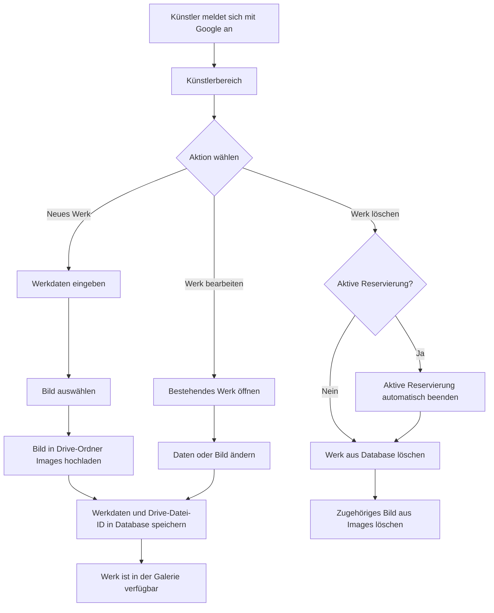

# Werkpflege durch den Künstler

Der Künstler pflegt Werke vollständig über den RentArt-Client. Bilder werden in Google Drive gespeichert; das Google Sheet enthält die fachlichen Daten und die Referenz auf die Bilddatei.

## PoC-Regel

Ein Werk darf auch mit aktiver Reservierung direkt gelöscht werden. In diesem Fall beendet die Anwendung die aktive Reservierung automatisch und löscht anschließend das Werk samt Bild. Der Künstler muss das Werk vorher nicht erst manuell auf verfügbar setzen.
