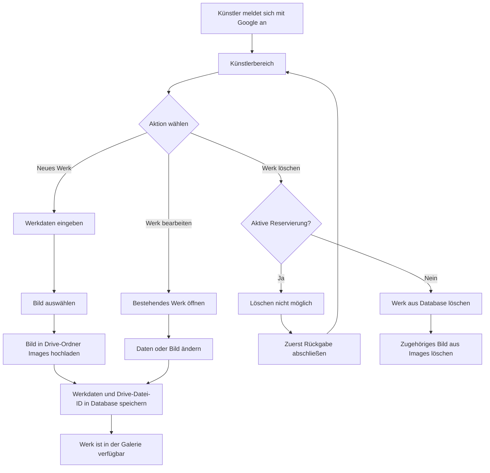

# Werkpflege durch den Künstler

Der Künstler pflegt Werke vollständig über den RentArt-Client. Bilder werden in Google Drive gespeichert; das Google Sheet enthält die fachlichen Daten und die Referenz auf die Bilddatei.

## PoC-Regel

Ein Werk mit aktiver Reservierung wird nicht gelöscht. Nach bestätigter Rückgabe ist es wieder verfügbar und kann anschließend gelöscht werden.
