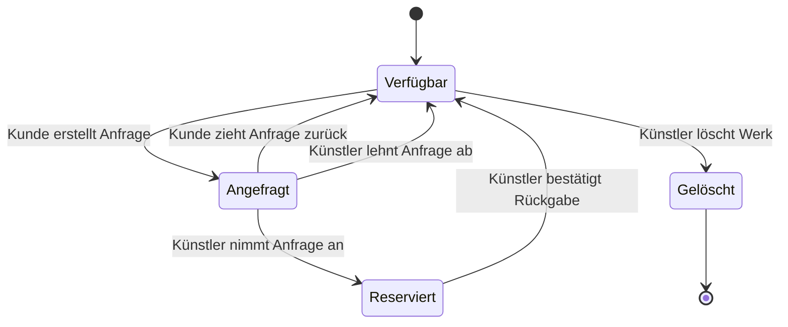
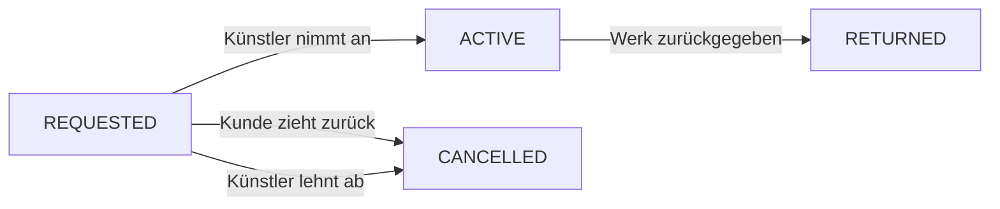

# Reservierungsablauf

Der Kunde kann für ein verfügbares Werk eine Anfrage erstellen und diese zurückziehen, solange sie noch nicht angenommen wurde. Der Künstler kann die Anfrage annehmen oder ablehnen. Nach der Rückgabe wird das Werk wieder verfügbar.

## Status der Reservierung

Eine abgeschlossene oder stornierte Reservierung kann für die Historie im Sheet erhalten bleiben. Für die Galerie zählt nur, ob aktuell eine offene oder aktive Reservierung für das Werk besteht.
