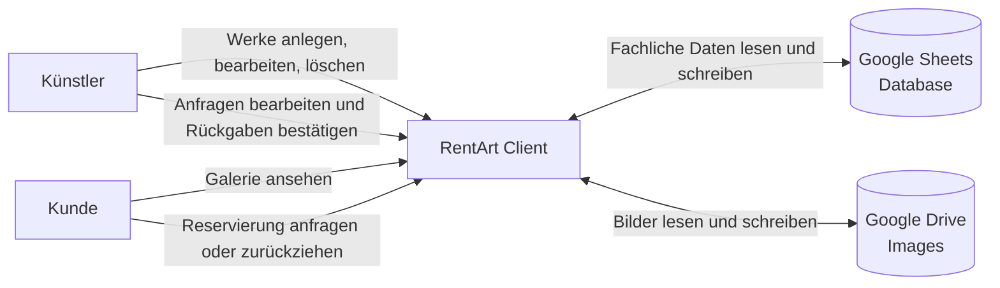

# Gesamtübersicht

Das Diagramm zeigt die beiden fachlichen Rollen und den direkten Zugriff des Clients auf Google Sheets und Google Drive im Proof of Concept.

## Grundidee

Beide Rollen arbeiten ausschließlich über die RentArt-App. Für den PoC vertrauen wir den freigeschalteten Google-Konten und verzichten auf eine zusätzliche Server-Schicht.
